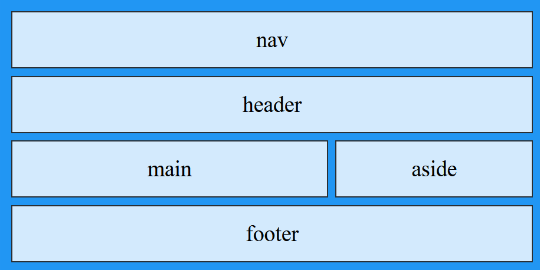

# Lab 6 Instructions

## Using CSS Grid and Flexbox

You will practice using Gird and Flexbox by applying them to the review web site from your previous lab assignment.

### Part 1: CSS Grid

Modify the site style sheet (.css file) for your site to use grid areas to control the layout of your review pages (just the reviews, not the home page).

1. Add a CSS rule to create a grid container element, which could be the `body`. This rule should contain a grid-template-areas property for the layout you want for all of your review pages. There should be at least 4 rows and three columns, at least one row should have multiple items in it. This is one possible layout:  
   

2. Add rules for the grid-areas to the site style sheet.

### Part 2: Flexbox

Use flexbox containers to control the layout of these parts of your web pages:

1. The horizontal nav bar: arrange the links horizontally and set the alignment of the link items.
2. Header: arrange the items in the header vertically and control the spacing and alignment.
3. Footer: arrange the items (text and or symbols in spans) horizontally and control the spacing and alignment.

Put the CSS for this in the external style sheet for the whole site so that it will be applied to all the pages.

Check your pages using the [W3C HTML Validator](https://validator.w3.org)  and the [W3C CSS Validator](http://jigsaw.w3.org/css-validator/).

## Submission

#### Publishing to citstudent

- Use FileZilla to upload the folders containing your web site to citstudent.
  - Do <u>not</u> zip the files.
  - Since both parts 1 and 2 are in the same web site, you can just upload that one web site.
- Record the URL (web address) of your home page so that you can enter it in the text area on Moodle.
  Hint: remember that *public_html* is <u>not</u> part of the URL.

#### Submitting to Moodle

- Zip the web site (both parts 1 and 2 are in one web site).

- Upload the zip file to Moodle.

- Enter the URL (web address) of your site's home page in the "Online Text" box for this assignment on  Moodle. This is important; without this, I won't be able to find your web page on the internet.

## Assessment

Your lab assignment will be assessed using [this rubric](Lab6Rubric_8wk.htm).

------

 Web Authoring Lab Instructions by [Brian Bird](https://profbird.dev), written <time>2023</time>, are licensed under a [Creative Commons Attribution-ShareAlike 4.0 International License](http://creativecommons.org/licenses/by-sa/4.0/). 

------------

