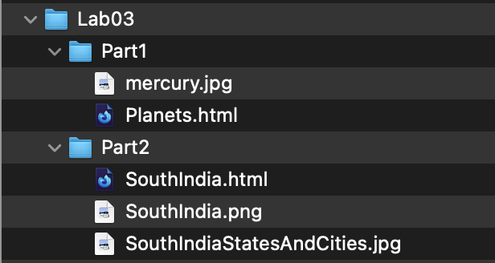

**CIS 195, Web Authoring 1: HTML**

# Lab 3 Instructions

## Part 1: A web page with internal links

Create a single web page that contains short sections of information on some topic. The page should have a set of links at the top of the page that take a user to those sections on the same page. The page should use each of the following HTML elements:

- A `<nav>` element that will contain a set of links. 

  (The set of links doesn't have to be in an `<uo>` or `<ol>` list element, it could be a series of links with ` ` tags after each one so they are arranged vertically on the page.)

- Hyperlink, `<a>`, elements with *href* attributes that link to *id* attributes in elements on the same page&mdash;at least four.

- An Image link. This is just a hyperlink with an image inside instead of text.

- A hyperlink to an e-mail address.

Please pick a topic other than the one in my example web page and create your own links and ids rather than copying and pasting mine.

## Part 2: A web page with an image map

Create another web page which contains a picture (of your choice) that has at least three regions that are appropriate for hot-spots.  

- Create hot-spots for each of the regions in the picture. 
- Use each of the three hot-spot shapes (rect, circle and poly) at least once.
- Each hot-spot should link to another page.
- The linked pages should all be in a single sub-folder. There should be at least three linked pages in the folder.
- At least one of the links should go to an internal location in one of the linked pages ( a link to an id).
- Use the `<base>` element to specify the sub-folder that contains the linked pages.

Check your pages using the [W3C HTML Validator](https://validator.w3.org)  

## Submitting your Web Sites

- To Moodle:

  - Zip the files in part 1

  - Zip the files in part 2

  - Upload both zip files to Moodle using the lab submission link.

- To the citstudent web server:  
  **For fall 2023, you won't be required to upload the web site to citstudent.**
  - Use FileZilla to copy your entire lab3 folder, subfolders and files to citstudent. The folder structure should be like this:  
    

Use your own file names. It's ok, but not required to name the HTML file in each folder index.html.  

Note: there will be a total of four .html files in the Part2 folder.

## Grading Criteria

[Lab 3 Rubric](Lab3Rubric-CIS195.htm)

  

