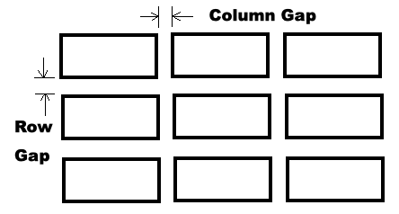
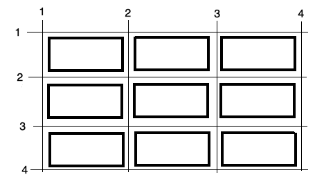

---

title: CSS Grid
description: How to position items on the page using the CSS Grid. 
keywords: display, grid, inline-grid
generator: Typora
author: Brian Bird
---

**CIS195 Web Authoring 1: HTML**

<h1>Using the CSS Grid for Layout</h1>

<table>
  <thead>
    <tr>
      <th colspan="2">Topics by Week for the Eight-Week Term</th>
    </tr>
  </thead>
  <tbody>
    <tr>
      <td>1. Intro to HTML</td>
      <td>5. Midterm, Layout with CSS</td>
    </tr>
    <tr>
      <td>2. More HTML, file paths</td>
      <td><mark>6. CSS Grid and Flexbox</mark></td>
    </tr>
    <tr>
      <td>3. Site structure and navigation</td>
      <td>7. HTML Tables</td>
    </tr>
    <tr>
      <td>4. Formatting with CSS</td>
      <td>8. HTML Forms, Final</td>
    </tr>
  </tbody>
</table>


<table hidden>
  <thead>
    <tr>
      <th colspan="2">Topics by Week for the Ten-Week Term</th>
    </tr>
  </thead>
  <tbody>
    <tr>
      <td>1. Intro to HTML</td>
      <td>6. Layout with CSS</td>
    </tr>
    <tr>
      <td>2. More HTML, file paths</td>
      <td>7. HTML Tables</td>
    </tr>
    <tr>
      <td>3. Site structure and navigation</td>
      <td>8. HTML Forms</td>
    </tr>
    <tr>
      <td>4. Formatting with CSS, Midterm</td>
      <td>9. Multimedia, Final</td>
    </tr>
    <tr>
      <td>5. Project Propposal, Midtern</td>
      <td>10. Project Completion, Final</td>
    </tr>
  </tbody>
</table>
<h2>Contents</h2>

[TOC]

## Q and A

-   Review due dates on Moodle.
-   Answer questions about this week's lab assignment.

## Grid Container Elements

The CSS *grid* is used to position elements on a page. 

- The grid needs to be created inside some *container element*.  
- The container can be any element that can hold other elements, like `div` or  `section`.
- The `display: grid` or `display: inline-grid`  property must be applied to the container. 

  This is what makes the element a container for a grid!

  - The `grid-template-column` property determines the width and number of columns.


For example, this HTML code:
```html
<div style="display: grid; grid-template-columns: auto auto auto;">
  <div>Item 1</div>
  <div>Item 2</div>
  <div>Item 3</div>  
  <div>Item 4</div>
  <div>Item 5</div>
  <div>Item 6</div>  
  <div>Item 7</div>
  <div>Item 8</div>
  <div>Item 9</div>  
</div>
```

Will be displayed like this on the web page:

Item 1						Item 2						Item 3  

Item 4						Item 5						Item 6  

Item 7						Item 8						Item 9  

Note that the three `auto` values in  `grid-template-columns: auto auto auto` are what specify the three columns and that their width is automatically determined.

## Grid Rows and Columns

- Columns; the number of columns and their width are specified using the `grid-template-column` property as seen above. It can have the following values:
  - `auto`:  the width is determined automatically.
  - `max-content`:  the width is determined by the largest item in the column.
  - `min-content`:  the width is determined by the smallest item in the column.
  - numeric value:  any valid CSS width value with units including px, pt, in, em, %, etc.
- Rows: The height is specified by the `grid-template-row` property.
  - This property can have all the same values as those shown above.
  - If there are more rows than values, the last value will be applied to the rest of the rows.

Example:

```html
<!-- in an embedded style sheet -->
  .container {
    display: grid; 
    grid-template-columns: 200px 200px 200px; 
    grid-template-row: 50px 50px;
  }

<!-- in the body -->
<div class="container">
  <div>Item 1</div>
  <div>Item 2</div>
  <div>Item 3</div>  
  <div>Item 4</div>
  <div>Item 5</div>
  <div>Item 6</div>  
  <div>Item 7</div>
  <div>Item 8</div>
  <div>Item 9</div>  
</div>
```


## Grid Lines and Gaps

A gap is like a combination of padding and margin in the CSS box model; it's just the space between rows or columns. 

-  **Grid gaps** are set using one or more of these properties with any valid numeric length value:

  - `column-gap`: sets the width of the column gap.

  - `row-gap`: sets the height of the row gap.

  - `gap`: sets both the column and row gaps.




- **Grid lines** are invisible lines that you can use to align things on your grid. They are numbered from left to right and from top to bottom.

  

An element can be made to span multiple columns using the column lines as a reference; for example:

  ```css
  .item2 {
    grid-column-start: 2;
    grid-column-end: 4;
  }
  ```

An element can be made to span multiple rows using the row lines as a reference; for example:

  ```CSS
  .item3 {
    grid-row-start: 2;
    grid-row-end: 4;
  }
  ```

We can apply these CSS rules like this:
```html
<div style="display: grid; grid-template-columns: auto auto auto;">
  <div>Item 1</div>
  <div class="item2">Item 2</div>
  <div class="item3">Item 3</div>  
  <div>Item 4</div>
  <div>Item 5</div>
  <div>Item 6</div>  
  <div>Item 7</div>
  <div>Item 8</div>
  <div>Item 9</div>  
</div>
```

Which will look like this on the web page:

Item 1						Item 2  

Item 3						Item 4						Item 5  

​									Item 6						Item 7

Item 8						Item 9  


## Grid Template Areas

Grid template areas are often used to control the layout of an entire page.

For example, this css rule:

```css
.grid-container {
     display: grid;
     grid-template-areas:
       'header header header'
       'menu main sidebar'
       'section section sidebar'
       'footer footer footer';
```

And this HTML:

```html
<div class="grid-container">
  <header style="grid-area: header;">header</header>
  <nav style="grid-area: menu;">menu</nav>
  <main style="grid-area: main;">main</main>
  <section style="grid-area: section;">section</section>
  <aside style="grid-area: sidebar;">sidebar</aside>
  <footer style="grid-area: footer;">footer</footer>
</div>
```


Produce this layout:


## Reference

[CSS Grid Tutorial](https://www.w3schools.com/css/css_grid.asp) by W3schools  

------

[](http://creativecommons.org/licenses/by-sa/4.0/) Web Authoring Lecture Notes, written by [Brian Bird](https://profbird.dev) in <time>2023</time>, are licensed under a [Creative Commons Attribution-ShareAlike 4.0 International License](http://creativecommons.org/licenses/by-sa/4.0/). 

------------

