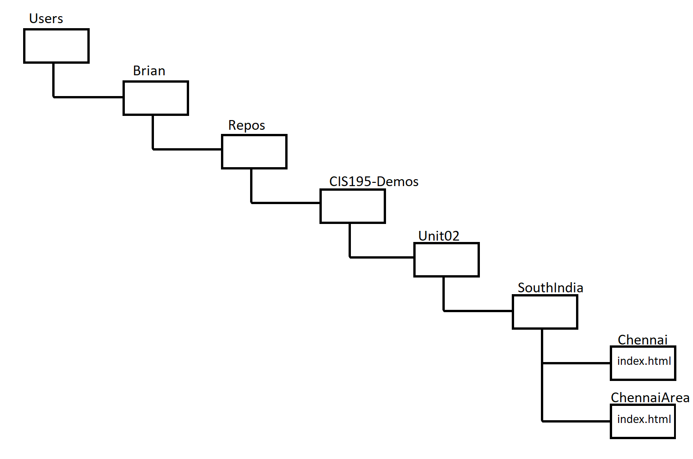
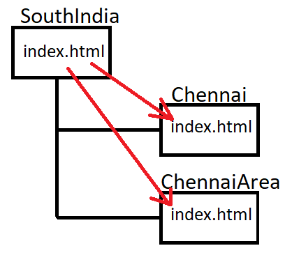
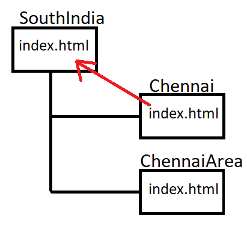
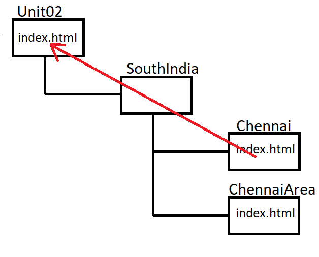
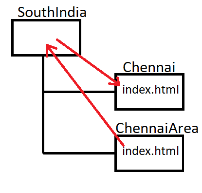

**CIS195 Web Authoring 1: HTML**

# Folders, Files, and Paths

| Course weeks and topics              |                         |
| ------------------------------------ | ----------------------- |
| 1. Intro to HTML 5                   | 6. Page Layout with CSS |
| 2. <u>More HTML</u>, History of HTML | 7. HTML Tables          |
| 3. Developing a Web Site             | 8. HTML Forms           |
| 4. Design with CSS                   | 9. Multimedia           |
| 5. Midterm                           | 10. Term Project        |

**Contents**

[TOC]

## Folders and Paths

Folders (called directories on Linux) can hold files or other folders. When folders hold other folders, we say they are *nested*. Look at some nested folders in the Windows file explorer, or in the Mac OS finder.

A path describes the hierarchy of nested folders that leads to a particular folder or file. Here's are two examples:

```bash
C:/Users/Brian/Repos/CIS195-Demos/Unit02/SouthIndia/Chennai/index.html
C:/Users/Brian/Repos/CIS195-Demos/Unit02/SouthIndia/ChennaiArea/index.html
```



#### Path Delimiters

The items in a path are separated by slashes. Windows originally used *back-slashes*,
`\` 
which is different from Mac OS and Linux which use *forward-slashes*.
 `/`
Windows now will accept either one. I recommend using forward-slashes since they are more universally recognized.

### Absolute paths

A path that includes all of the folders, starting with the first one is called an absolute path. The paths in the example above are absolute and even includes the drive letter. 

The drive letter is optional if you are specifying a path on the same drive where the web page doing the specifying is located. If you leave off the drive letter the path looks like this:

`/Users/Brian/Repos/CIS195-Demos/Unit02/SouthIndia/Chennai/index.html`

Notice that the path starts with a slash.

### Relative paths

A relative path specifies the location of a file or folder relative to some other folder. For example, if you are in the `SouthIndia` folder, then the relative path to the Chennai and ChennaiArea web pages would be: 

`Chennai/index.html`
`ChennaiArea/index.html`

Notice that there is no slash at the beginning of a relative path.

#### Linking to a page in a sub-folder

If there is a web page in the `SouthIndia` folder, you could put links in it to the other two pages like this:

```html
<a href="Chennai/index.html">Chennai</a>
<a href="ChennaiArea/index.html">Chennai Area</a>
```



#### Linking to a page in a parent folder

You use two dots and a slash to specify going up one level in a path: `../`
For example, you could put a link in the Chennai web page to the SouthIndia web page like this:

```html
<a href="../index.html">South India</a>
```



If you want to go up by more than one folder, use double-dot-slash multiple times. For example, if  there is an index.html page in the Unit02 folder and you want to link to it from the Chennai page, the link would look like this:

```html
<a href="../../index.html">Unit 2"</a>
```



#### Linking to a page in a sibling folder

To make a link to a folder that is a "sibling" (at the same level in the hierarchy), you need to use two-dots-slash to go up a folder and then go down to the sibling folder. For example, lets say you want to put a link from the `ChennaiArea/index.html` page to the `Chennai/index.html` page. You would need to go up one folder and then back down, like this:

```html
<a href="../Chennai/index.html">South India</a>
```




### Best practice

Always use relative paths. If you use absolute paths, your web site's links will break when you put it on a different computer (like a server, or your instructor's computer).


## Reference

[HTML File Paths](https://www.w3schools.com/Html/html_filepaths.asp)&mdash;W3Schools

------

[](http://creativecommons.org/licenses/by-sa/4.0/) These lecture notes are licensed under a [Creative Commons Attribution-ShareAlike 4.0 International License](http://creativecommons.org/licenses/by-sa/4.0/), by [Brian Bird](https://profbird.dev/), fall 2020, updated fall 2022.