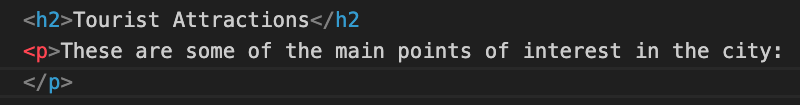

**CIS195 Web Authoring 1: HTML**

<h1>More Basic HTML Elements</h1>

<table hidden>
  <caption>Topics by Week for the Eight-Week Term</caption>
  <thead>
    <tr>
      <th scope="col">Weeks 1-4</th>
      <th scope="col">Weeks 5-8</th>
    </tr>
  </thead>
  <tbody>
    <tr>
      <td>1. Intro to HTML</td>
      <td>5. Layout with CSS</td>
    </tr>
    <tr>
      <td>2. More HTML, file paths</td>
      <td>6. HTML Tables</td>
    </tr>
    <tr>
      <td>3. Site structure and navigation</td>
      <td>7. HTML Forms</td>
    </tr>
    <tr>
      <td>4. Formatting with CSS, Midterm</td>
      <td>8. Multimedia, Final</td>
    </tr>
    </tbody>
</table>
| Weeks 1-5 | Weeks 6-11 |
| :--- | :--- |
| 1. Intro to HTML | 6. Layout with CSS |
| <mark>2. More HTML, file paths</mark> | 7. CSS Flexbox and Grid |
| 3. Site structure and navigation | 8. HTML Forms |
| 4. Formatting with CSS | 9. Multimedia |
| 5. Midterm, Project Propposal | 10. Tables, Project Completion |
|  | 11. Final |
[Topics by Week for the Ten-Week Term]


<h2>Contents</h2>

[TOC]

# Q and A

- Any questions about anything?
- Review due dates.

# Review

Empty web site skeleton:

```html
<!DOCTYPE html>
<html lang="en">

<head>
    <title>Skeletal Page</title>
    <meta charset="UTF-8">
</head>
  
<body>
  This is an empty web page.
</body>

</html>
```


HTML elements you've learned so far:

- Line break:`<br>`
- Paragraph: `<p>`
- Image: ``
- Anchor (hyperlink): `<a>`
- Lists:`<ol>` and `<ul>`
- Text style: `<strong>`or `<b>` and `<em>` or `<i>`
- Headings:`<h1>`, `<h2>`, `<h3>`, etc.


# Checking Your Code

## Visual Studio Code

VS Code will automatically let you know if you make mistakes (use wrong syntax) in your HTML code. It does this by turning the code where it detects the error red.




## W3C Syntax Validator

Define "syntax"

<a href="https://validator.w3.org" target="_blank">W3C HTML Validator</a>


# In-line and Block Elements

**In-line elements** arrange themselves horizontally on the page. Examples are:

- Hyperlinks:`<a>`
- Formatting, like:`<strong>`, `<em>`, etc.
- Images:``

**Block elements** arrange themselves vertically on the page. Examples are:

- headings: `<h1>`, ` <h2>`,  etc.

- paragraph: `<p>`

- lists: `<ul>` and `<ol>`

  

# Nested Elements

Some elements can be *nested*, placed inside, other elements. You've already seen that in the basic skeleton of a web site where the `body` and `head` are nested inside the `html` element. To make the code easier to read, we indent the nested elements.  
Here's an example:  

```html
<p>
  This is a <i>paragraph</i> with some <b>nested</b> elements inside it.<br>
  <a href="https://example.com">This is nested inside the paragraph too.</a>
</p>
```

## Nesting Rules

- The opening and closing tags of a nested element must be between (inside) the opening and closing tags of the outer element. 
- Inline elements cannot contain block elements.
- Some block elements <u>cannot</u> contain other block elements.  
  Check the *Permitted Conten*t in the <a href="https://developer.mozilla.org/en-US/docs/Web/HTML/Element" target="_blank">MDN HTML Element</a> reference.
  - paragraph, `<p>`, elements can only contain <a href="https://developer.mozilla.org/en-US/docs/Web/HTML/Content_categories#phrasing_content" target="_blank">phrasing content</a>.
  - headings, `<h1>`, `<h2>`, etc. can only contain phrasing content.
  - lists, `<ol>`, or `<ul>` can only contain `<li>` elements.
  - list items, `<li>` elements can only contain <a href="https://developer.mozilla.org/en-US/docs/Web/HTML/Content_categories#flow_content" target="_blank">flow content</a>.

## Nested Lists

Lists can be placed within lists. The right way to do it is to put the nested list inside a li element of the parent list. For example:

```html
<ul>
   <li>Deserts
     <ul>
         <li>Pie</li>
         <li>Cake</li>
        <li>Ice Cream</li>
      </ul>
  </li>
  <li>The rest of the list</li>
</ul>
```

In a browser, the nested lists would look like this:

- Deserts
  - Pie
  - Cake
  - Ice Cream
- The rest of the list


# More HTML Elements 

## Figures

Figures are used to change images from inline to block elements. They also allow you to add a caption to the image.

```html
<figure>
  
  <figcaption>MDN Logo</figcaption>
</figure>
```

Try it out: <a href="https://www.w3schools.com/tags/tag_figure.asp" target="_blank">Figure on W3Schools</a>  

## Block Quotes

The block quote element will:

- Indent the text

- Put blank lines above and below the text

```
<blockquote>
  Not all who wander are lost.
</blockquote>
```

In a browser the `blockquote` would look like this:

<blockquote>
  Not all who wander are lost.
</blockquote>

Try it out: <a href="https://www.w3schools.com/TAGS/tag_blockquote.asp" target="_blank">Blockquote on W3Schools</a>  

### Cite

Use this element to cite the work of someone else.

```html
from "The Riddle of Strider" in <cite>The Fellowship of the Ring</cite> by J.R.R. Tolkien
```

If we put this inside the block quote, it will look like this in the browser

<blockquote>
  Not all who wander are lost.<br>
  from "The Riddle of Strider" in <cite>The Fellowship of the Ring</cite> by J.R.R. Tolkien
</blockquote>
## Special Characters

Certain characters are not allowed (reserved characters) in HTML. For example, if you use the less than, `<`, or greater than, `>`, signs in your text, the browser is likely to see them as tags. The solution is to use *character entities* to display reserved characters. The code below shows two ways to write the character entities for `<` and `>`

```html
&lt; or &#60; and &gt; or &#62;
```

Here are two ways to write the character entity for the copyright symbol, &copy;

```html
&copy; or &#169;
```

<a href="https://www.w3schools.com/html/html_symbols.asp" target="_blank">Listing of special characters on W3Schools</a>  

<a href="https://www.w3schools.com/charsets/ref_emoji_smileys.asp" target="_blank">Emojis for the Web on W3Schools</a>

## Comments

```html
<!-- this is a comment -->
```

## Horizontal Rule

The `<hr>` tag will put a horizontal line across the page. This is one of the "empty" tags.


# References

<a href="https://www.w3schools.com/tags/default.asp" target="_blank">HTML Element Reference</a> &mdash;W3 Schools

<a href="https://developer.mozilla.org/en-US/docs/Web/HTML/Element" target="_blank">HTML Elements Reference</a> &mdash;Mozilla Developer Network

<a href="https://code.visualstudio.com" target="_blank">Oficial VS Code web site</a>&mdash;Microsoft

<a href="https://validator.w3.org" target="_blank">HTML Syntax Validator</a>&mdash;World Wide Web Consortium

<a href="https://developer.mozilla.org/en-US/docs/Web/HTML/Content_categories" target="_blank">Content Categories</a>&mdash;Mozilla Developer Ntework

<a href="https://stackoverflow.com/questions/30233447/what-is-the-difference-between-phrasing-content-and-flow-content" target="_blank">Phrasing Content vs. Flow Content</a>&mdash;Stack Overflow

------

<a href="http://creativecommons.org/licenses/by-sa/4.0/" target="_blank"></a> These lecture notes are licensed under a <a href="http://creativecommons.org/licenses/by-sa/4.0/" target="_blank">Creative Commons Attribution-ShareAlike 4.0 International License</a>, by <a href="https://profbird.dev/" target="_blank">Brian Bird</a>, revised Fall <time>2023</time>.

