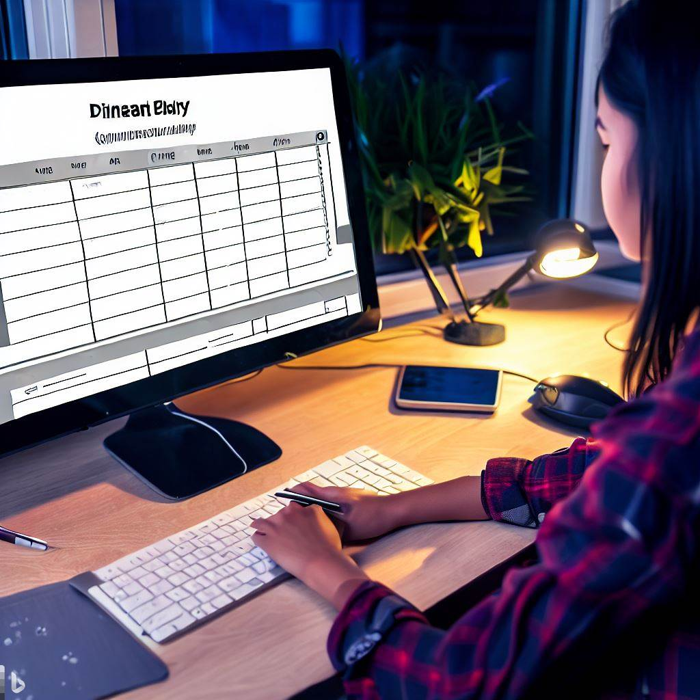

**CIS195 Web Authoring 1: HTML**

<h1>Overview and Announcements for Week 10</h1>

<h2>HTML Tables</h2>

<figure style="float: right; margin: 0 0 1em 1.5em; width: 200px;">
  
  <figcaption>Image generated by AI</figcaption>
</figure>

## Overview

This week you will learn how to create tables using HTML and style them using CSS. You will also complete your term project.

## Learning Objectives

These are table features you will learn about:

- Headings and footers
- Cells that span multiple rows or columns
- Captions

------

 Web Authoring Lecture Notes by <a href="https://profbird.dev" target="_blank">Brian Bird</a>, 2018, revised 2026, are licensed under a <a href="http://creativecommons.org/licenses/by-sa/4.0/" target="_blank">Creative Commons Attribution-ShareAlike 4.0 International License</a>.
