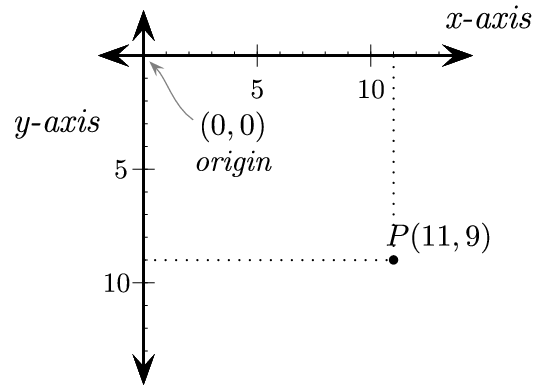

<h1>Images and Image Maps</h1>


| Weeks 1-5 | Weeks 6-10 |
| :--- | :--- |
| 1. Intro to HTML 5                         | 6. Page Layout with CSS |
| 2. More on Creating Web Pages              | 7. HTML Tables          |
| 3<u>. Site Design + More on Hyperlinks</u> | 8. HTML Forms           |
| 4. Design with CSS                         | 9. Multimedia           |
| 5. Midterm                                 | 10. Term Project        |

[Course topics by week]


<h2>Contents</h2>

[TOC]

## Common Image Formats

### BMP 

The bitmap format is an uncompressed file format. This is not normally used on web pages because the files tend to be large. Bitmap files will have the extension .bmp.

### GIF

The **G**raphic **I**nterchange **F**ormat is used for uncompressed, animated images.

### JPEG

**J**oint Photographic **E**xperts **G**roup is a lossy compression algorithm that is popular for compressing images to be used on the web because it can be used to make very small image files, but with loss of image quality. JPEG files will have the extensions .jpg, or .jpeg. 

JPEG files may also be formatted using **JFIF** (Joint File Interchanging Format) and have the extensions .jfif or .jif.

### PNG

**P**ortable Network **G**raphics is a lossless compression algorithm that is also popular for images in web pages.

### WebP

**W**eb **P**icture  is a newer type of compression algorithm that is becoming more popular for use on web pages. It offers better compression than JPEG or PNG, can be used for either lossless or lossy compression and for still or animated images.


##Image Maps

Images can be divided into different zones, or *hotspots*, each linked to a different target destination.

To define hotspots, you create an *image map* that contains `<area>` elements that map  specified regions of the  image to specific web pages or locations.

```html


<map name="farm">
  <area coords="380,60,500,270" shape="rect" href="beans.html" alt="A cup of coffee beans">
  <area shape="circle" coords="300,130,70" href="press.htm" alt="A french press">
  <area shape="polygon" coords="10,65,15,260,350,260,350,225,230,225,230,60" href="tree.htm" alt= "A coffee tree">
  <area shape="default" coords="0, 0, 650, 525" … />
</map>
```


####Hotspot attributes

- `coords`: coordinates (location) of the hotspot.
- `shape`
- `href`
- `alt`
###Computer graphics coordinate system

In two dimensional computer graphics, a cartesian coordinate system is used in which the x-axis starts at the left and extends to the right and the y-axis starts at the top and extends to the bottom.



Image from <a href="http://programarcadegames.com/index.php?chapter=introduction_to_graphics" target="_blank">Program Arcade Games with Python and PyGame</a>

#### Finding coordinates in an image

You can use a photo editing program like Windows Paint, Gimp, or Photoshop (or Photoshop Elements) to find coordinates, or you can use an online service like the one shown in the reference section of these notes.

###Rectangular hotspots

Two points define a rectangular hotspot:
the upper-left corner
the lower-right corner.

```html
<area coords="380,60,500,270" shape="rect" href="beans.html" alt="A cup of coffee beans">
```

### Circular hotspots

A circular hotspot is defined by the location of its center and its radius.

``` html
<area shape="circle" coords="300,130,70" href="press.htm" alt="A french press">
```


### Polygonal hotspots

To create a polygonal hotspot, you enter the coordinates for each vertex in the shape.

```html
<area shape="polygon" coords="10,65,15,260,350,260,350,225,230,225,10,65" href="tree.htm" alt= "A coffee tree">
```


### Default hotspot

```html
<area shape="default" href="plantation.html" alt="Our farm">
```

- Where the first pair of numbers is always zero and the second pair are the width and height of the image in pixels.
- Any spot that is not covered by another hotspot will activate the default hotspot link


##Reference

<a href="https://developer.mozilla.org/en-US/docs/Web/Media/Formats/Image_types" target="_blank">Image file type and format guide</a>&mdash;MDN article

<a href="https://www.webfx.com/blog/web-design/jpeg-101-a-crash-course-guide-on-jpeg/" target="_blank">JPEG 101: A Crash Course on JPEG</a>&mdash;WebFX article

<a href="https://www.w3schools.com/tags/tag_map.asp" target="_blank">HTML <map> Tag</a>&mdash;W3Schools tutorial

<a href="https://www.mobilefish.com/services/record_mouse_coordinates/record_mouse_coordinates.php" target="_blank">Online service for getting mouse-click image coordinates</a>&mdash;Mobilefish.com


------

<a href="http://creativecommons.org/licenses/by-sa/4.0/" target="_blank"></a> Web Authoring Lecture Notes by <a href="https://profbird.dev" target="_blank">Brian Bird</a>, 2017, revised 2022, are licensed under a <a href="http://creativecommons.org/licenses/by-sa/4.0/" target="_blank">Creative Commons Attribution-ShareAlike 4.0 International License</a>. 

------------